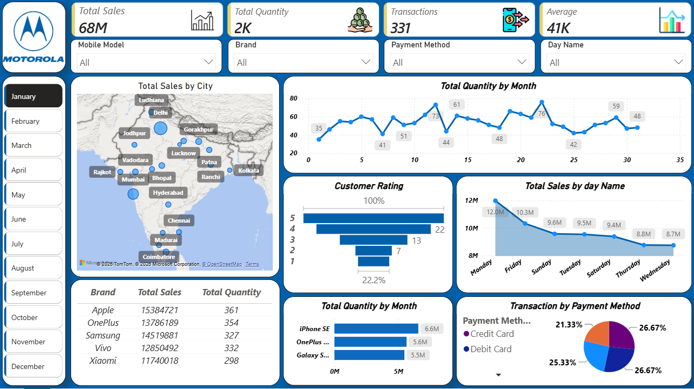

# Power-BI-Sales-Dashboard-------

An interactive **Power BI Sales Dashboard** built to analyze Mobile Sales performance across different cities, brands, months, payment methods, and customer ratings.

### Key Insights

* Total Sales & Quantity
* Sales by City and Brand
* Monthly Sales/Quantity Trends
* Sales by Day Name
* Customer Rating Analysis
* Payment Method Distribution
* Top Mobile Models
* Interactive filters for Month, Brand, Mobile Model, Payment Method, and Day Name

**Tools Used:** Power BI, DAX, Data Visualization

This dashboard helps transform raw sales data into clear, interactive business insights for better decision-making.

